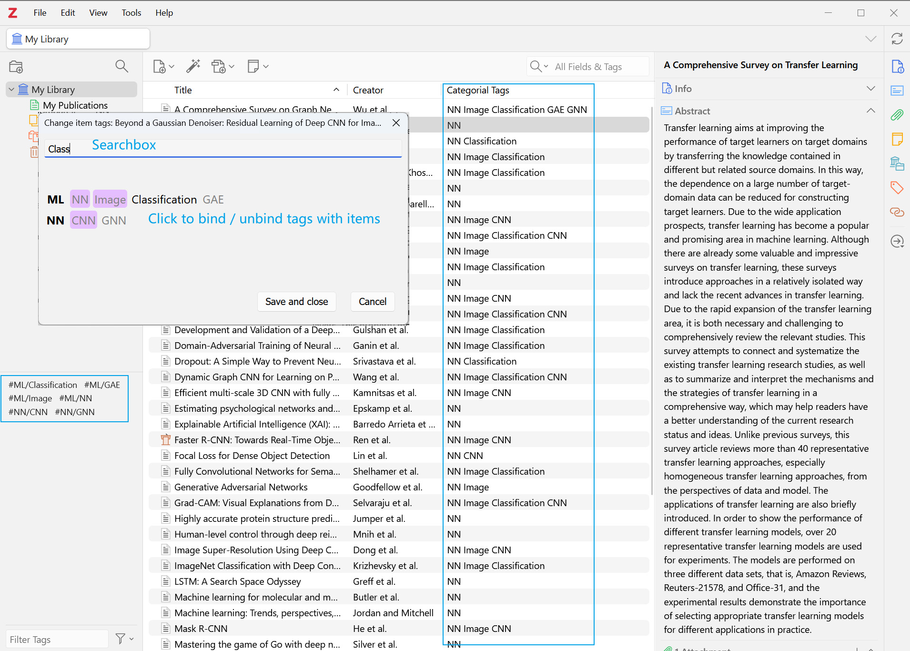

# Zotero Categorial Tags 插件

## 简介

**Zotero Categorial Tags** 是一款为 Zotero 用户设计的插件，旨在提升标签管理效率。通过 **分类标签**
，用户可以更有条理地组织、检索和管理文献资料，优化研究和学习过程。

## 功能特性

- **分类标签列**：在条目列表中添加分类标签列，直观显示每个文献的标签信息。
- **分类标签支持**：使用 `#类别/标签名` 格式将标签划分为不同类别，便于管理和查找。
- **快捷键操作**：按 `Ctrl + T`（可自定义）快速打开标签管理对话框。
- **标签管理对话框**：提供用户友好的界面，支持对现有标签的添加和移除。
- **模糊搜索与拼音搜索**：支持模糊匹配和拼音搜索，快速定位标签。

## 安装方法

### 方法一：插件商店安装

- 前往 [Zotero 插件商店](https://github.com/syt2/zotero-addons) 查找并安装 **Zotero Categorial Tags**。

### 方法二：手动安装

1. 从 [GitHub 仓库](https://github.com/panhaoyu/zotero-categorial-tags) 下载最新的 `.xpi` 文件。
2. 打开 Zotero，点击 `工具` -> `附加组件` -> 齿轮图标 -> `从文件安装附加组件...`，选择 `.xpi` 文件完成安装。
3. 重启 Zotero 激活插件。

## 使用指南

### 创建分类标签

**注意**：插件不支持创建新标签，只能将文献绑定到已有标签上。请在 Zotero 中手动创建符合格式的标签后使用插件管理。

1. **格式要求**：标签需以 `#` 开头，包含 `/` 作为类别与标签名的分隔符。

2. **示例**：
    - `#学科/数学`
    - `#主题/机器学习`
    - `#阅读状态/已读`

### 标签绑定流程

1. **选择文献项**：在 Zotero 主界面中，选中一个或多个文献项。
2. **打开标签管理对话框**：按自定义快捷键（默认 `Ctrl + T`）打开标签管理窗口。
3. **搜索并管理标签**：使用搜索栏查找标签，支持拼音和模糊搜索，点击标签选中或取消选中。
4. **完成绑定**：按 `回车` 键保存更改。

### 查看分类标签

1. 在 Zotero 主界面右键点击条目列表的列标题。
2. 勾选 `分类标签`（或 `Categorial Tags`），即可显示每个文献的分类标签。

## 贡献与支持

- **问题反馈**：使用过程中遇到问题，请在 [GitHub 问题页面](https://github.com/panhaoyu/zotero-categorial-tags/issues) 提交
  Issue。
- **功能建议**：欢迎提出改进建议。
- **贡献代码**：欢迎提交 Pull Request，帮助完善插件。

## 待解决的问题

- **Mac 系统支持**：目前尚未在 macOS 上进行测试，因为缺少测试设备。欢迎 Mac 用户进行测试并反馈。
- **标签创建功能**：插件不支持创建标签，需手动创建。目前尚未决定如何实现该功能，如果用户有想法，欢迎在 Issue 中交流。
- **更多个性化设置**：未来版本将加入更多自定义选项。
- **界面美化**：当前界面未进行美化，视觉效果较为简单。欢迎有设计经验的用户提供建议或提交 PR。

欢迎对上述问题的改进提交 Pull Request。

## 更新日志

- **v0.1.9**: 增加自定义快捷键功能。
- **v0.1.0**: 初始发布，支持分类标签管理、模糊和拼音搜索、快捷键操作。

## 许可证

- 本项目采用 [MIT 许可证](https://github.com/panhaoyu/zotero-categorial-tags/blob/main/LICENSE) 开源。

## 鸣谢

- **zotero-plugin-template**: 感谢提供的初始模板，提高了开发效率。
- **zotero-style**: 感谢关于 `#Tags` 功能的探索，为插件开发提供了重要启发。
